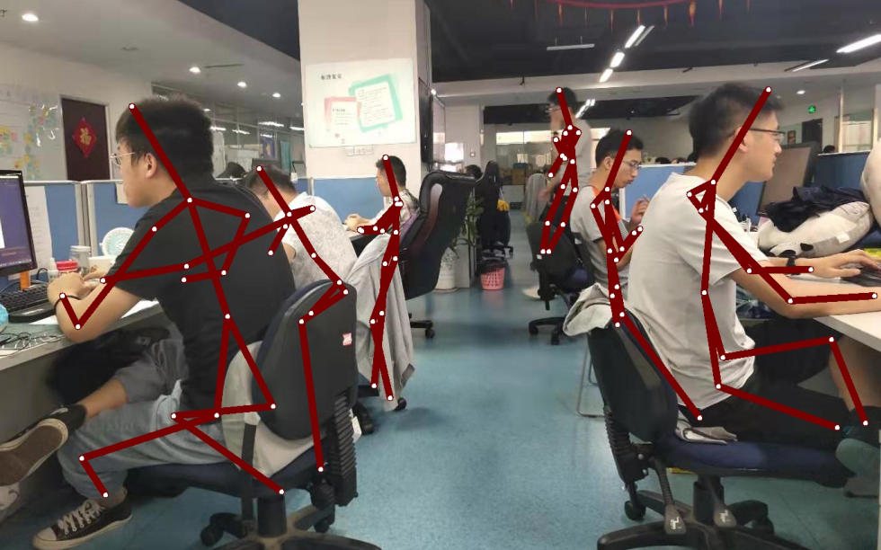

AtrousPose 
Sierkinhane/AtrousPose: real time multi-person pose estimation based on atrous convolution
https://github.com/Sierkinhane/AtrousPose

人体姿态检测

resnet50

修改train.py

data_dir = '/mnt/disk01/fangjin/AtrousPose/data/images'
mask_dir = '/mnt/disk01/fangjin/AtrousPose/data/masks_for_mpii_pose'  #解压后的masks目录要放到masks_for_mpii_pose'目录下
json_path = '/mnt/disk01/fangjin/AtrousPose/data/MPI.json'

训练生成模型dilated_pose_done.pth文件（已放百度盘 个人研究/ai/model 下）

运行
修改demo.py中的：
input_image = './images/liuxiang.jpg'	#源文件
output = "./images/result.jpg"		#目标文件
weight_name = './legacy/dilated_pose_done.pth'	#模型文件

效果图：

